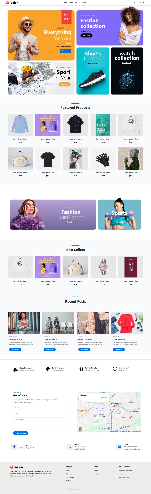
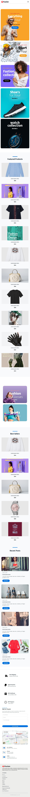

# E-Commerce Website Landing Page

## Project Overview

This project is a responsive **E-Commerce Website Landing Page** developed...

The goal of this project is to demonstrate frontend development skills, UI/UX understanding, responsiveness, and clean code structure by building a professional landing page using modern frontend technologies.

---

## Features

### Navigation Bar
- Brand / logo placeholder
- Navigation links (Home, Shop, Blog, Contact)
- Responsive mobile menu
- Fixed navigation with smooth user experience

### Hero / Landing Section
- Professional and modern layout
- Promotional banners and offers
- Clear call-to-action buttons
- Fully responsive design

### Product Sections
- Featured products section
- Best sellers section
- Multiple product cards
- Each product card includes:
  - Product image
  - Product name
  - Product price

### Promotional Banners
- Highlighted product banners
- Call-to-action buttons
- Responsive layout for all screen sizes

### Blog / Post Section
- Recent posts layout
- Image, date, title, description
- Read more button

### Contact Section
- Contact form
- Embedded Google Map
- Address, phone, and email information

### Footer
- Company information
- Useful navigation links
- Clean and structured layout
- Copyright section

### Extra Features
- Scroll-to-top button
- Responsive design for mobile, tablet, and desktop
- Icons using Remix Icons

---

## Technologies Used

- **HTML5**
- **Tailwind CSS**
- **Custom CSS**
- **JavaScript** (used only for UI interactions such as mobile menu and scroll-to-top button)

---

## UI & Code Standards

- Clean, modern, and professional UI
- Fully responsive across all screen sizes
- Well-structured and readable code
- Proper indentation and naming conventions
- Follows standard frontend development practices

---
## Screenshots

### Desktop View

### Mobile View

